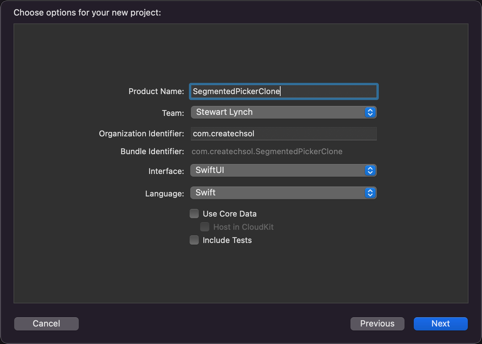
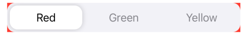
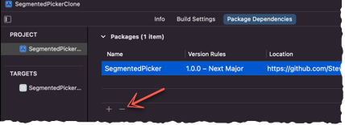
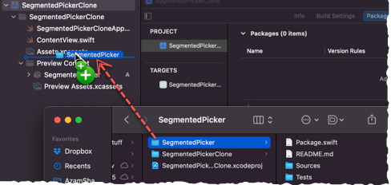
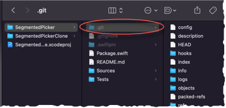
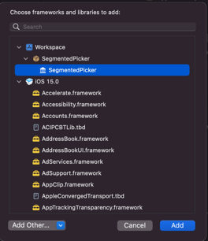

# Cloning a Swift Package and Modifying It

[TOC]

<iframe width="560" height="315" src="https://www.youtube.com/embed/7rFPvj7yu4Q" title="YouTube video player" frameborder="0" allow="accelerometer; autoplay; clipboard-write; encrypted-media; gyroscope; picture-in-picture" allowfullscreen></iframe>

Why would you want to install a local copy of a Swift Package and modify it?  You may wish to simply pick through the code so you can get a better understanding of how things are done and improve your skills.  I often do this by altering the code and seeing how it affects things. Perhaps the package is no longer being maintained and is not working with the latest OS, so it needs updating.  Or, you may wish to improve upon the package for your own purposes.

When you use Swift Package Manager to install a Swift Package, you can inspect the code, but you can't make any modifications to it.

In this article, you will learn how to clone a Swift Package from a GitHub repository and add it to your own project as a local framework so that you can modify it.

> **Caution:** If you are going to be cloning someone else's work then altering and using it for your own purposes, make sure that you read the license file to ensure that you are allowed to do that and identify any requirements there might be for giving appropriate credit

### The source code

For this exercise, I am going to use code that was produced by *Frank Jia* in his article titled **Build a Custom iOS Segmented Control With SwiftUI** published on **Medium** at https://betterprogramming.pub/custom-ios-segmented-control-with-swiftui-473b386d0b51

I have made only minor modifications to the code to make it compatible as a Swift Package, and to add an accessibility property.  Otherwise, I make no claim to the code, I am using it only as an example for my tutorial.

### The Swift Package

The swift package I created can be found at https://github.com/StewartLynch/SegmentedPicker but more on that shortly.

### Create A Test Project

For this exercise, create a Swift project using SwiftUI and call it **SegmentedPickerClone**



We are going to be replacing the standard Segmented Picker that comes out of the box in SwiftUI with the custom one that Frank creates in his artcle.  Then we are going to clone it and install it as a local framework and make some modifications.

#### The SwiftUI Segemented Picker

The standard SwiftU picker of the type SegmentedPickerStyle can be created using the SwiftUI Picker constructor that requires a title, and selection bound to some value and an array of strings or views that you can use for the segment labels.

For example, you can create a @State property like this for selection

`````swift
@State private var selection: Int = 0
`````

The array of items could be an array of strings representing colors like this:

`````swift
var colors = ["Red", "Green", "Yellow"]
`````

We then replace that Hello World TextView with a Picker that is a segmented picker like this and make sure you apply the pickerStyle moderator designating it as `.segmented`:

`````swift
Picker("Pick your favorite color", selection: $selection) {
    ForEach(0..<colors.count, id: \.self) { index in
        Text(colors[index]).tag(index)
    }
}
.pickerStyle(.segmented)
`````

### Installing the Swift Package

Frank's custom segmented picker provides us with a much easier syntax and it also opens up some real possibilities for our own customizations.

So let's get started.

Installing Swift Packages is extremely easy compared to installing a CocoaPod.   This is all you have to do.

1. Copy the URL from the repository (https://github.com/StewartLynch/SegmentedPicker)
2. In Xcode, from the **File** menu, choose **Add Packages...**
3. In the search field, paste the copied URL.  If the URL is recognized, it will be displayed along with the **Dependency Rule**.
4. Click on **Add Package**
5. After resolution, when the next screen appears, click on **Add Package** once more.

That's it.  You have installed the package

##### Inspect the Package

If you want to inspect the package contents, drill down on the **Package Dependencies** until you reach the      **Sources/\<PackageName>** folder and inside there, you will find the code for the package. There is only one file for this package and we will come back to this later when we need to modify the code.

##### The Framework

The package is installed as a **framework** and this means that it is in a separate module so all properties and functions that you need to access from your project must be **public.**

If you select your project target, and scroll to the **Frameworks, Libraries, and Embedded Content** section you will see that the framework has been added to your project.

Now it is time to use it.

### Using the Package

Wherever you wish to use the package, you need to import it.  So in ContentView, we want to replace the Picker we have right now with that new custom one called **SegmentedPicker**.  So in ContentView, add

`````swift
import SegmentedPicker
`````

Replace the entire Picker you have in the body now (including the pickerStyle modifier) with an instance of SegmentedPicker.

When you do this, you see that it has three arguments, an String, an array of String and a binding to an Int.

For the label which will be used as the accessory lable, we can use the same string and for our items, we can use or colors array.  The selection is bound to the selection property.

`````swift
SegmentedPicker("Pick your favorite color", items: colors, selection: $selection)
`````

This is a much nicer implementation and the segmented picker is arguably nicer too.

What I would like to do is to customize that picker by allowing the user to specify the color that they wish to use as the background behind the segments.

If we add a background modifier to our Picker right now, it just does not work.

`````swift
SegmentedPicker("Pick your favorite color", items: colors, selection: $selection)
    .background(Color.red)
`````



The background of this picker (and a regular picker too) is the background of the entire view so this doesn't work.

If you read Frank's article you will see how he created this custom picker.  

If we drill down to the SegmentedPicker source, we can see that there is a private static property called **BackgroundColor** that is assigned as the background for the custom picker.

What we want to be able to do is to modify that color so it can't be static, buy when you try to do this, you will find that it is not possible.

Swift Packages are not modifiable.  You need to "own" the framework and that is what the whole point of this tutorial is all about.

### Clone the Package and add locally

You could go to the GitHub repository and clone the package and add it to your project as a local framework, but there is a fast and easy way to do this.

1. Right-click on the package dependency and choose **Show in Finder**.  This will open up the finder to the location where the package has been added.  It is a pretty deep dive, but don't worry about that. 

2. Right-click on the selected folder and **copy** it to your **clipboard**.

3. Back in Xcode, right-click on the project name at the top of the project navigator and choose **Show in Finder** and this will open the finder to the root level of your project.

4. **Paste** in the copied folder from step 2.

5. Return to Xcode and **remove the Swift Package**.  To remove the package, you

   1. Select your project name in the project navigator and then click on the **Project**.
   2. Click on the **Package Dependencies** tab to view all dependencies.
   3. Click on the one you want to remove and then click on the "**-**" button.

   

6. Bring up your root folder once more where you pasted it in step 4 and, drag and drop the folder from there into your project navigator.

   

   This will add the project in as a framework.

7. Close the project. 

   I have had issues with source control when doing it this way, so I recommend that you remove source control entirely at this point and add it back later if you want.  

8. To remove source control,

   1. Open the new framework folder and enter **⌘-⇧-.** (that is a period) and that will reveal hidden files.
   2. Delete the .git folder
      
   3. Enter **⌘-⇧-.** once more to hide the hidden files again.

9. You still need to add the framework to your target so open the project once more and select your project name in the navigator then select your target and scroll to the **Frameworks, Libraries, and Embedded Content** section.

10. Click on the **+** button and the list of frameworks and libraries will be displayed.  Select your new framework from the workspace section and click on **Add** and this will add it to your target.




You should now be able to build and run your project just as before.  The difference is that now, you will be able to modify the code.

### Modifying the Code

What I am going to do next is show you two different ways in which you can modify that background of the picker.  

#### Property Method

The first way that you can do this is by making that backgroundColor property in the SegmentedPicker code available to be modified if we want, from the project

1. Open the **SegmentedPicker.swift** file from the **Sources/SegmentedPicker** folder in the framework.
2. Change the static property with the initial value into a variable of the same name, but do not assign the default color here. 

`````swift
private static let BackgroundColor: Color = Color(.secondarySystemBackground)
TO
var backgroundColor: Color
`````

The first time you edit the file, you will be asked to unlock it.  What we are doing is replacing the static property with a variable one.  In order for this to be accessible when we create the instance of SegmentedPicker from outside of this framework,  we need to modify the initializer for the struct which is marked as being public.  It is here where we assign that default color.

3. Change the initializer to the following:

`````swift
public init(_ label: String, items: [String], selection: Binding<Int>, backgroundColor: Color = Color(.secondarySystemBackground)) {
    self.label = label
    self._selection = selection
    self.items = items
    self.backgroundColor = backgroundColor
}
`````

4. Replace the background property of the body with this new value.

`````swift
from
.background(SegmentedPicker.BackgroundColor)
to
.background(backgroundColor)
`````

##### Test

Return to ContentView and if you build, you will see that nothing has changed.  However, if you type a comma after the second argument in SelectedPicker, you now see that you can add a third argument and that is **backgroundColor** so do that and pick a different color.

`````swift
SegmentedPicker(items: colors, selection: $selection, backgroundColor: .green)
`````

#### Modifier Method

This is not very "SwiftUI-ish" in that in with SwiftUI, you are less likely to pass additional arguments into a view.  You normally see this done with a modifier like "backgroundColor" that we can modify and force an update the view.

So let's remove that code in the initializer.

1. Set the initial value now where we create backgroundColor.

`````swift
var backgroundColor: Color = Color(.secondarySystemBackground)
`````

2. Since it is now initialized with a value, we no longer need it in the initializer.
3. Create a new **public** function called **backgroundColor** that has a color property as a parameter and return a SegementedPicker view.

`````swift
public func backgroundColor(_ color: Color) -> SegmentedPicker {

}
`````

4. In the body of the function, create a property called **view** and assign **self** to it.
5. Set the **backgroundColor** property to the **color** argument passed in,  and finally, return the updated view.

`````swift
public func backgroundColor(_ color: Color) -> SegmentedPicker {
    var view = self
    view.backgroundColor = color
    return view
}
`````

Return now to the contentView and remove the now, not accessible backgroundColor from the initializer and add a new **.background** modfier to the SegmentedPicker view passing in some color.

`````swift
  SegmentedPicker("Pick your favorite color.", items: colors, selection: $selection)
    .backgroundColor(.green)
`````

That's it.

### Working with a ViewModel

If you want to work with a viewModel using MVVM and an **Observable** object,  let's see how we can do that here.

1. Create a new swift file called **MyColor** and create a struct that we can use as our model and change the import to **SwiftUI**.

   `````swift
   import SwiftUI
   struct MyColor {
       var name: String
       var color: Color
   }
   `````

2. Inside the struct, create a static property called **mockColors** that returns an array of these MyColor objects like this:

   `````swift
   static var mockColors: [MyColor] {
       [
           MyColor(name: "Red", color: .red),
           MyColor(name: "Green", color: .green),
           MyColor(name: "Yellow", color: .yellow)
       ]
   }
   `````

3. Create a new swift file called ViewModel and create a class called **ViewModel** that conforms to the **ObservableObject** protocol.  Also change the import to **SwiftUI**.

   `````swift
   import SwiftUI
   
   class ViewModel: ObservableObject {
       
   }
   `````

4. Create a property call colors that is an array of MyColor and initialize it as an empty array.

   `````swift
   var colors:[MyColor] = []
   `````

   **Note:** if you are going to be updating this from your view,  it should be decorated with the @Published property wrapper, but we are not, so there is no need here because we are going to assign it in the initializer.

5. Create an initializer that will assign the MyColor.mockColors to this property

   `````swift
   init() {
       colors = MyColor.mockColors
   }
   `````

6. Create a Published property called **selection**, that is an **Int**, initialized at 0, the default segment.

   `````swift
   @Published var selection: Int = 0
   `````

7. Create another var that is called names and initialize it as an empty array of string

   `````swift
   var names = [String]()
   `````

8. In the initializer, map the names from colors array to that property

   `````swift
   init() {
       colors = MyColor.mockColors
       names = colors.map{$0.name}
   }
   `````

9. Create one more computed property called **selectedColor** of type Color and return the color property of the MyColor item in the colors array specified at the index of the **selection**.

   `````swift
   var selectedColor: Color {
       colors[selection].color
   }
   `````

10. Return to ContentView now and replace the two properties with a single StateObject to initialize the viewModel

    `````swift
    @StateObject var vm = ViewModel()
    `````

11. Use the Viewmodel properites now for the SegmentedPicker.

    `````swift
     SegmentedPicker("Pick your favorite color.", items: vm.names, selection: $vm.selection)
    `````

12. Use the viewModels's selectedColor as the backgroundColor modifier's color.

`````swift
.backgroundColor(vm.selectedColor)
`````

Now, when you and select a segment, the background of the picker will take on the color of the selected segment.

Nice, simple and readable code.

`````swift
struct ContentView: View {
    @StateObject var vm = ViewModel()
    
    var body: some View {
        SegmentedPicker("Pick your favorite color.", items: vm.names, selection: $vm.selection)
            .background(vm.selectedColor)
            .padding()
    }
}
`````
